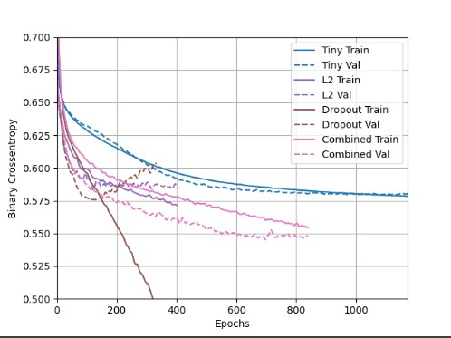

# Tuesday Response (Higgs)
#### 1. 
- Describe the dataset.

    - The dataset consists of 11,000,000 examples of data collected on particles to distinguish between two processes that either produce Higgs bosons or do not produce Higgs bosons. 
    
- What type of variable is the target? 
  
    - The target variable is continuous since the target values are numerical.
- How many features are being used? 
  
    - There are 28 features. The first 21 are measurements of kinetmetic properties from particle accelerator data. The last 7 help distinguish between the two classes of data. 
  
- How many observations are in the training dataset? 
    - 10,000 observations.
  
- How many are used in the validation set?
    - 1,000 observations

#### 2. 
- How did each of the four models perform (tiny, small, medium and large)? 

  - The tiny model performed well as the train and test values stayed consistent with one another and the general trend was that the cross-entropy decreased at a reasonable rate as the number of epochs increased. The difference between the train and value metrics for the tiny model was consistently small which is normal. Both the medium and large models were severely overfitting, represented by the test data and train data moving in opposite directions. On the small model the validation metric appeared to be stagnant as the train metric continued to improve which is a sign that the model was close to overfitting. 

- Which of the four models performed the best? Which ones performed the worst? 
  - The tiny model performed the best and the large and medium models performed the worst.

- Why in your estimation did certain models perform better?
  - I think the smaller models performed better because there was less data to process and therefore less data to fit the model to, reducing the chance of error or overfitting. 

#### 3. Apply regularization, then add a drop out layer and finally combine both regularization with a dropout layer. Produce a plot that illustrates and compares all four models. 

- Why in your estimation did certain models perform better?
  - The combined model performed the best as it was resistant to overfitting and had a lower overall Binary Crossentropy. This is likely to do the combination of dropping random values, reducing the amount of data and potentially reducing the variation of the data, with the regularization of the L2 model. The combination of those features made for a more consistent dataset that would be less likely to over or underfit as the data was changed to be more uniform. The Dropout model likely did not perform as well as the combined model because the data was varied and had enough peramaters that the extra regularization was necessary for it to perform well.

#### 4. 
- What is an overfit model?
    - An overfit model is one that has learned patterns from the training data that do not apply to all the test data and often occurs when a model is too complex. In other words, the model becomes overly designed for the training data and cannot adjust to the addition of new data with new patterns well.
- Why is it important to address it? 
    - It is important to address it because an overfit model is limited in its prediction abilites and overall usefulness. If the model can only handle data similar to the training data, it is more difficult to apply the model to new information that we may need to apply a model to before designing one specific to the new data.
- What are four different ways we have addressed an overfit model thus far?
  1. L1 Regularization
  2. L2 Regularization
  3. Dropout Regularization
  4. Combination of L2 and Dropout