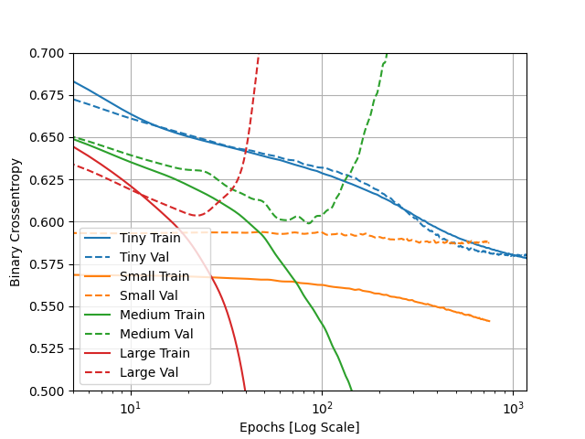

# Tuesday Response
#### 1. 
- Describe the dataset.

    - The dataset consists of 11,000,000 examples of data collected on particles to distinguish between two processes that either produce Higgs bosons or do not produce Higgs bosons. 
    
- What type of variable is the target? 
  
    - The target variable is continuous since the target values are numerical.
- How many features are being used? 
  
    - There are 28 features. The first 21 are measurements of kinetmetic properties from particle accelerator data. The last 7 help distinguish between the two classes of data. 
  
- How many observations are in the training dataset? 
    - 10,000 observations.
  
- How many are used in the validation set?
    - 1,000 observations

#### 2. 
- How did each of the four models perform (tiny, small, medium and large)? 

  - The tiny model performed well as the train and test values stayed consistent with one another and the general trend was that the cross-entropy decreased at a reasonable rate as the number of epochs increased. The difference between the train and value metrics for the tiny model was consistently small which is normal. Both the medium and large models were severely overfitting, represented by the test data and train data moving in opposite directions. On the small model the validation metric appeared to be stagnant as the train metric continued to improve which is a sign that the model was close to overfitting. 

- Which of the four models performed the best? Which ones performed the worst? 
  - The tiny model performed the best and the large and medium models performed the worst.

- Why in your estimation did certain models perform better? 
  - 

#### 3. Apply regularization, then add a drop out layer and finally combine both regularization with a dropout layer. Produce a plot that illustrates and compares all four models. Why in your estimation did certain models perform better?

#### 4. What is an overfit model? Why is it important to address it? What are four different ways we have addressed an overfit model thus far?