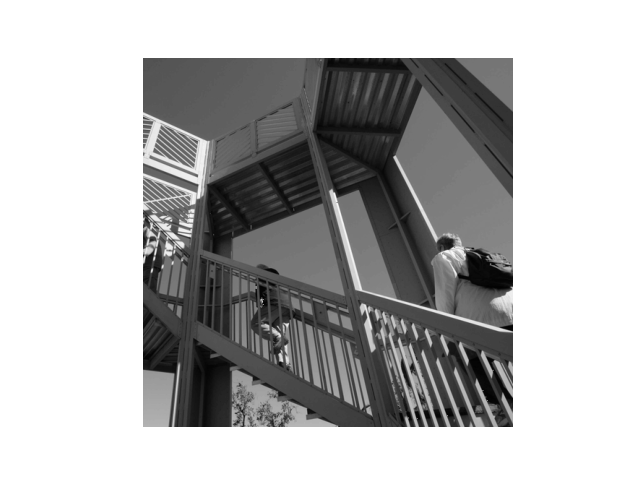
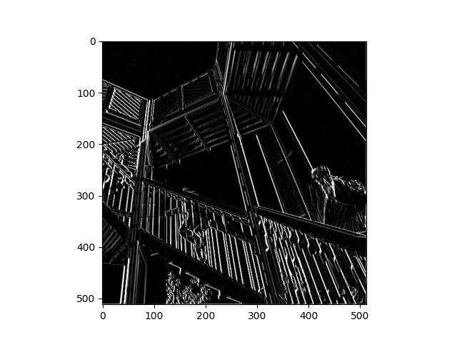
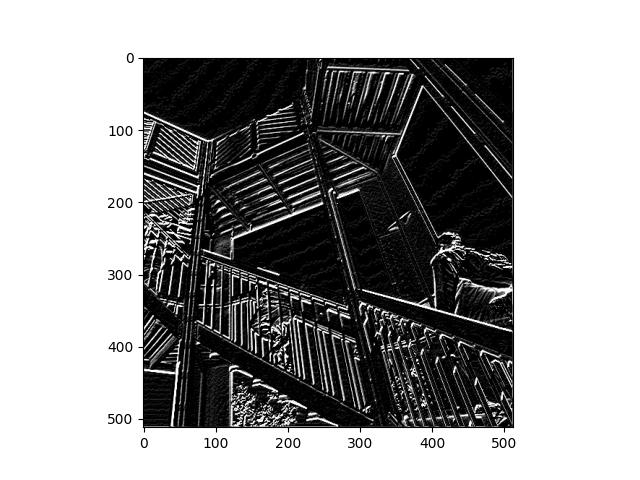
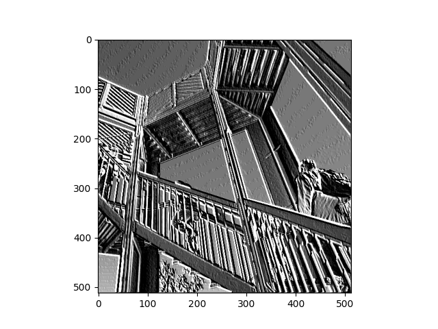
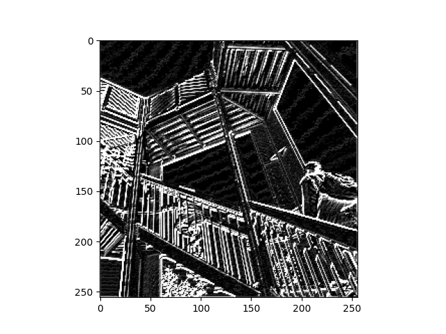
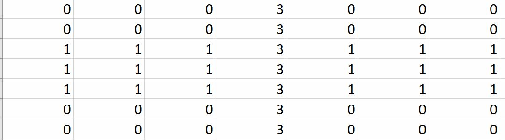

# Wednesday Response
#### 1. What are you functionally accomplishing as you apply the filter to your original array? 

- We are manually changing the 3x3 array that is applied to the staircase image. The change in filter tells the plot what features of the image to focus on and therefore changes characteristics such as what type of lines it enhances or colors it highlights. 

## Original Image

This is the original image on which the filters were applied. 

## Filter 1

Filter Applied: [ [4,0,2], [-3, -2, 3], [1, 0, -5]]
This Filter appeared to highlight vertical lines and drastically increased the overall contrast of the image. This was the simplest result of the three filters applied.
  
## Filter 2

Filter Applied: [ [-5, 0, 0], [-10, 0, 10], [1, 4, 0]]
This filter appeared to highlight both vertical and horizontal lines, picking out lines within the background that were not initially visible in the original image. The underside of the backpack is much more highlighted in this image than in the image with the first filter applied. The pickup of lines in both directions led to greater detail on the tree in the lower left hand corner of the image as well as on the wrinkles of the t-shirt on the person on the right hand side of the image.

## Filter 3

Filter Applied: [ [8, -1, 7], [-5, 0, 5], [-5, -2, -6]]
This filter appeared to pick up on the horizontal lines of the background as well but did not increase the contrast as the other two filters did. There was less focus on any dark colors in the image and the majority of them were eliminated. 

#### 2. 
- Why is the application of a convolving filter to an image useful for computer vision?
    - The application of a convolving filter to an image is useful because it makes it easier to train a model if an image can be filtered to be represented by the characteristics we want, ex: horizontal lines that were not initally seen in the original image. The fitler allow for more flexible and functional manipulation of images.

-  

### 3. 
- In effect what have you accomplished by applying this filter? 
    - 
    
- Does there seem to be a logic (i.e. maximizing, averaging or minimizing values?) associated with the pooling filter provided in the example exercise (convolutions & pooling)? 

- Did the resulting image increase in size or decrease? Why would this method be useful? 
    - The resulting image size decreased. This would be useful if we needed to simplify an image to emphasize the features of it we wanted to focus on most strongly.

Matrix Exercise:

