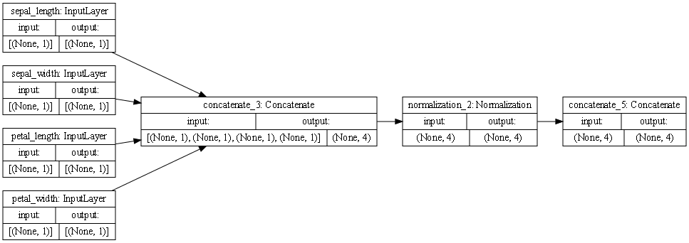

Are you using a different metric for each one? 
Why is this so? What is each one measuring?

# Iris Dataset

The first column of boxes represents the features of the dataset, each with an inout of (None, 1) and an output of (None, 1).

The second box, moving from right to left, represents the concatentation of all the features. This can occur in one step because all of the inputs from the features are numerical. This step had an input of (None,1), (None, 1), (None, 1), (None, 1), and an output of (None, 4).

The third box represents the normalization of the output of the concatenation, input of (None,4), output of (None, 4).

The fourth box represents the final concatenation step, of which there is only one path to because the features are of the same type and can be processed efficiently in the same way all around. This step had an input of (None, 4) and an output of (None, 4).

# Metro Dataset

The first column of boxes represents the features of the dataset.

In the second column of boxes, the box at the top position represents the concatenation of the numerical features of the dataset (temp, rain_1h, snow_1h, clouds), with an input of (None,1), (None, 1), (None, 1), (None, 1), and an output of (None, 4). This can occur in one step because these features provide numerical inputs. The boxes in the rest of the second column represent the processing of categorical features. The inputs of these categorical features are processed via string_lookup in order to prepare them for concatenation. Each of these categorical feature (holiday, weather_main, weather_description, date_time) processing boxes had an input of (None, 1) and an output of (None, 1).

In the third column of boxes the box at the top, preceded by the numerical feature concatenation, represents the normalization of the numerical features with an input of (None, 4) and an output of (None, 4). The boxes in the third column below the top one represent one-hot encoding of each of the categorical features. This helps the model distinguish between vocabulary words in the dataset and isolate the amounts of each categorical feature to learn from them. Each box has the same input of (None, 1), but they have different outputs due to the difference in amount of each feature.

The fourth box represent the final concatenation step. There are different paths to this box and it is evident since the inputs are (None, 4), (None, 14), (None, 13), (None, 40), and (None 40577). The output was (None, 40648). 

Each of these steps are important in order to properly process all data and train a model. If we were unable to convert all the features to a common form, we would be unable to train a model with all of these features. 

### What is the target for each dataset?

The target for the Iris dataset was the species of flower. The target for the metro dataset was the traffic volume.

### How would you assess the accuracy of each model?
The Iris model produced a loss of 0.2775 The metro model produced a loss of 3503260.5000. Based on the losses, I would think that the iris dataset is more accurate than the metro dataset. The Iris dataset only had four features which were all numerical, but the metro dataset was more complicated with both numerical and categorical features, as well as more features overall.

### Are you using a different metric for each one? Why is this so? What is each one measuring?

Yes we used MeanSquaredError for the metro dataset and BinaryCrossentropy for the Iris dataset. The BinaryCrossentropy is a simpler way of processing data which works for the Iris dataset because the Iris dataset could easily be turned into a series of 0's and 1's, which is fitting for a BinaryCrossentropy metric. The BinaryCrossentropy calculated the test and train distributions. The MeanSquaredError was fitting for the metro data because the dataset was measuring the traffic volume and was using a wide variety of variables so it required a more sophisticated metric and measures, and squares, the distance between the predicted and actual values. 