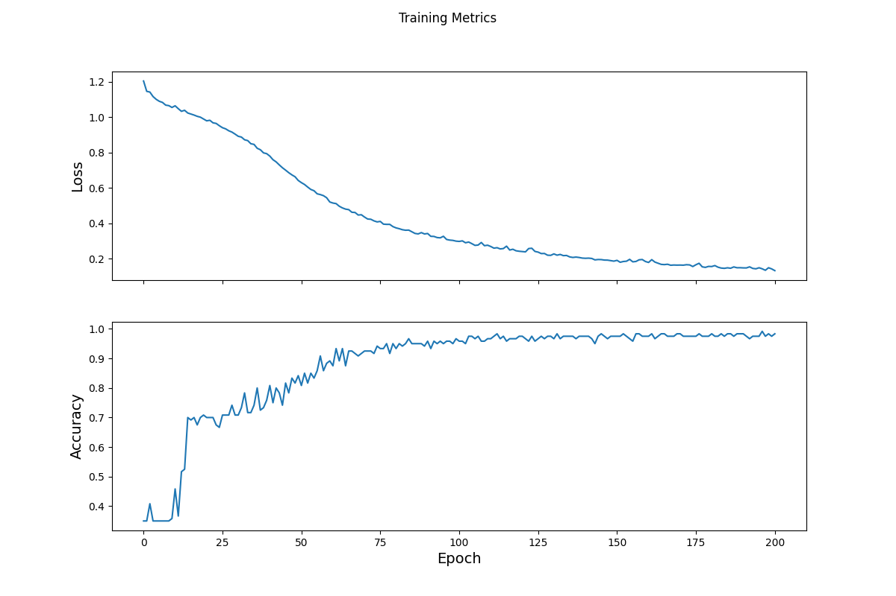
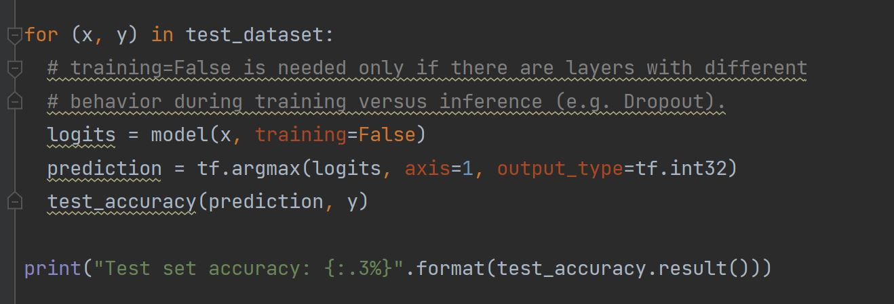
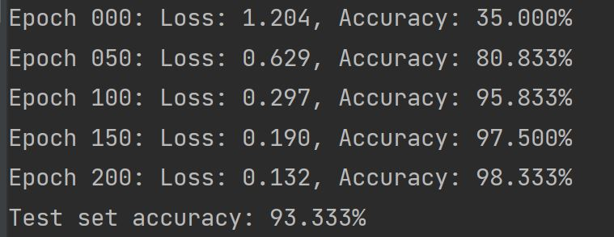
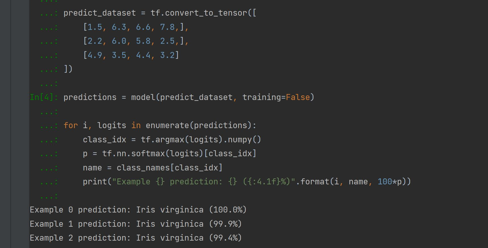

# Write up

#### Dataset
I used the Iris dataset. The Iris dataset is a multivariate dataset that consists of four features, sepal length, speal wdith, petal length, and petal width that all give numerical outputs. The dataset distinguishes between three species of flower, setosa, virginica, and versicolor, and the species is typically the target for models using this dataset.Regarding the three classes, one is more easily distinguished than the other two. 

#### Creating the Tf.Dataset
To create the tf.dataset I made use of TensorFlow's Dataset API. This read and transformed the data so I could use it for training. I used the function " tf.data.experimental.make_csv_dataset " in order to parse the data. This function automatically shuffles the dataset and repeats it forever. The batch_size parameter was set to 32. This function also returned a dataset of pairs (feature, label). The first part of the pairs "features" is a dictionary that contains the value associated with the feature name. Once the csv file was loaded in, I defined the column names, feature names, and label names as variables. 

#### Model Architecture Specifications

The model was designed as a neural network, utilizing multiple layers that receive inputs and communicate them to the next layer. In order to make the model building steps simpler, a function was created that turned the dictionary inmformation into a single array. The shape of the array was defined by the batch size and number of features. That function that was created used a method called tf.stack that combines values from a list of values and creates a combined tensor. The last step before the features are in the specified array is to used tf.data.Dataset#map to place the dictionary paris into the training dataset. After all of those steps are completed the array for input is complete. A neural network style model is superior to traditional "man-made" models because instead of having to search the data for patterns, the neural network design finds complex patterns far more efficiently and with more certainty. The model produces an output of what species of flower is most likely. 
To create the layers I used tf.keras.Sequential to specify a linear stack of layers and used two layers with ten nodes each. The output layer had 3 nodes that indicate which species of flower is most likely correct. The first layer had an input shape parameter that was the same as the number of features in the dataset, 4. In order to determine the output shape, the activation function, ReLU was used. Though increasing the number of layers generally produces a better and more powerful model, it requires more data to train with and this dataset was fairly small. The model also used softmax to convert predictions into a probability and argmax to provide the predicted class index. 

#### Training the Model

Supervised machine learning is the type of training used with this Iris dataset, meaning that the model is trained from examples that contain labels. One goal in training a model is to avoid overfitting, an overfit model indicates that the model did not learn the patterns of the data but rather memorized certain aspects and continually outputs those despite factors in the inputs changing. Training the model requires the calculation of a model's loss which determines the difference between a prediction created by the model and the actual value. The function tf.keras.losses.SparseCategoricalCrossentropy was used to calculate the loss. An optimizer, tf.keras.optimizers.SGD, was used to find the part of the function with the lowest loss and utilize those settings. 
A training loop was used to train the model. The training loop utilized epochs, analyzing the epochs, making predictions and comparing with labels, measuring loss, using the optimizer to adjust the varibales based on that loss value, recording the stats, and repeating again until all the epochs have fun. Each epoch is one pass through the datset and can be adjusted. We used 201 epochs.

#### Results

The loss initially starts out high, but as the epochs and optimizer run the loss decreases and the model learns about the dataset and the variables are adjusted. Towards the end the loss flattens out indicating that the model is at its optimal conditions for the amoutn of data it was given. The accuracy spikes at the beginning but then drops and eventually flattens out, gradually increasing as the epochs run. The increase in accuracy and the flattening out correspond to the gradual decrease of loss values and their steadiness over time. 

The test dataset produced an accuracy of 93.333% meaning that the model predicted the correct output for a test data input 93.333% of the time. This is a good accuracy. The model was evaluated by comparing the predictions against the actual label. However, to evaluate on the test dataset, only a single epoch is used of the test data. 

To make predictions, 3 unlabeled examples were provided to predict the results. The number are mapped to a name and are represented in a series such as [5.6, 7.8, 4.5 ,3.4].
The image above includes 3 unlabeled predictions and their accuracies.
