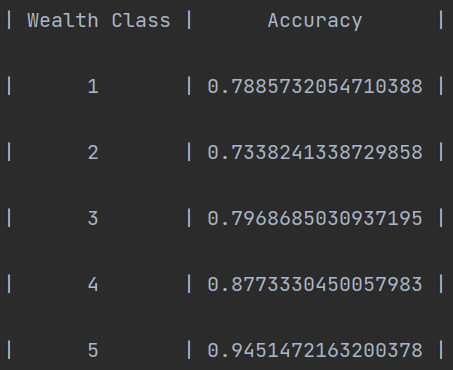

## Dataset Information:

The **locations** and the number of them recorded included in the dataset were the following:
Montserrado: 6364, Nimba: 4598, Lofa: 3385, Bong: 3318, Margibi: 3301, Maryland: 3183, Grand Cape Mount: 3123, Sinoe: 2961, Grand Kru: 2722, Grand Bassa: 2717, Grand Gedeh: 2706, Gbarpolu: 2547, River Cess: 2534, River Gee: 2432, and Bomi: 2328. 

The values for **size** ranged from 1 to 53.

The **Potable** classifications, along with how often they were recorded in the dataset: 

Protected well: 30467, River/dam/lake/ponds/stream/canal/irrigation channel: 11250, Unprotected well: 2920, Unprotected spring: 1091, Bottled water: 549, Protected spring: 486, Tube well or borehole: 422, Cart with small tank: 328, Public tap/standpipe: 311, Tanker truck: 130, Piped to yard/plot: 93, Piped into dwelling: 92, Rainwater: 47, 99: 33

The **Toilet** classifications, along with how often they were recorded in the dataset:

No facility/bush/field: 26389, Ventilated Improved Pit latrine (VIP): 9248, Flush to septic tank: 3544, Pit latrine without slab/open pit: 3438, Pit latrine with slab: 2894, Hanging toilet/latrine: 1753, Flush to pit latrine: 505, Flush to piped sewer system: 173, Flush to somewhere else: 114, Other: 72, Bucket toilet: 42, Composting toilet: 20, Flush, don't know where: 17, 99: 10, 

**Electric Status**: No: 5833, Yes: 2339, 9: 47

**Car Ownership:** 
No: 47094, Yes: 1101, 9: 24

**Cook:**

Wood: 36150, Charcoal: 11822, No food cooked in house: 193, Electricity: 23, Kerosene: 19, 99: 7, LPG: 5

**wealth** (from lowest to highest):

1: 14837, 2: 12743, 3: 10106, 4: 6028, 5: 4505

**gender:** 1: 24395, 2: 23824

**age** range: 0-99

**education** (most to least frequent level of education):

0: 26830, 1: 12095, 2: 8362, 3: 854, 9: 77, 8: 1

## Interpreting the Results

The lowest accuracy reported was for data of wealth class 2 with an accuracy of about 73%. Wealth classes 1, 3, 4, and 5 increased in accuracy in that order. Their accuracies were ~79%, ~80%, ~88%, ~95% respectively. The wealthiest classes were more easily predicted, this may be due to the amount of data for wealth classes 4&5. Wealth classes 4&5 had 6028 and 4505 data points respectively, which is enough to produce reliable data, but the features the model used ot predict, such as car, electric, toilet, etc. are very consistent with welathy living styles. The consistency of those features in higher wealth classes is likely the reason for a higher accuracy level than the other wealth classes, despite the lower wealth classes having more data. The lower wealth classes would have had a much greater variety in the presence/absence/ranking of the features used by the model, therefore reducing the accuracies. 

