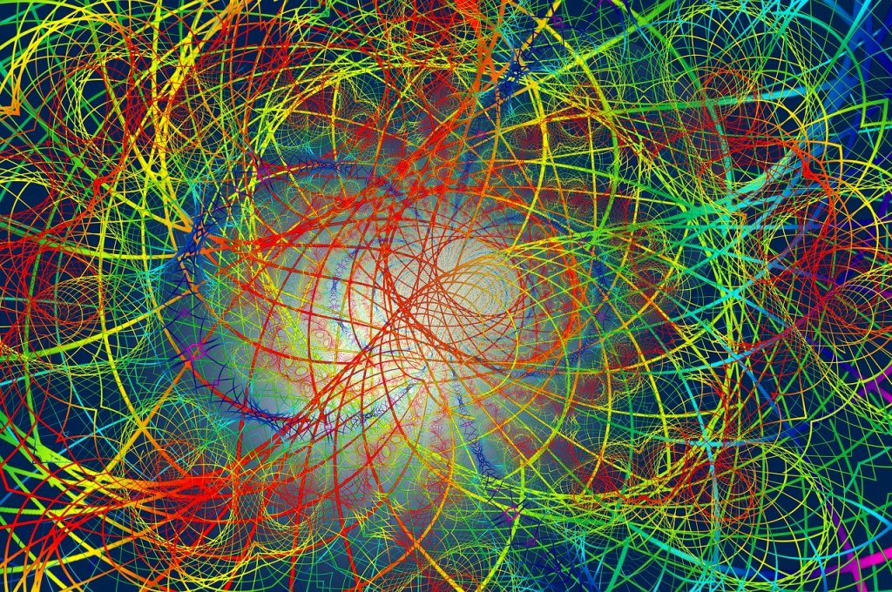
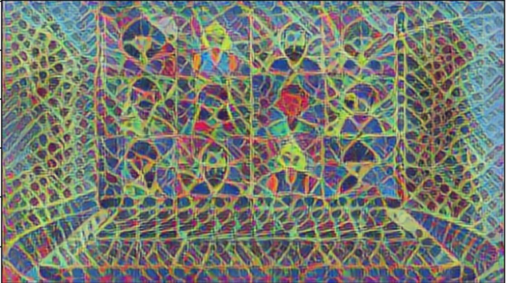
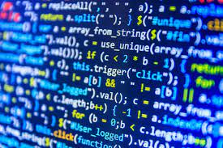
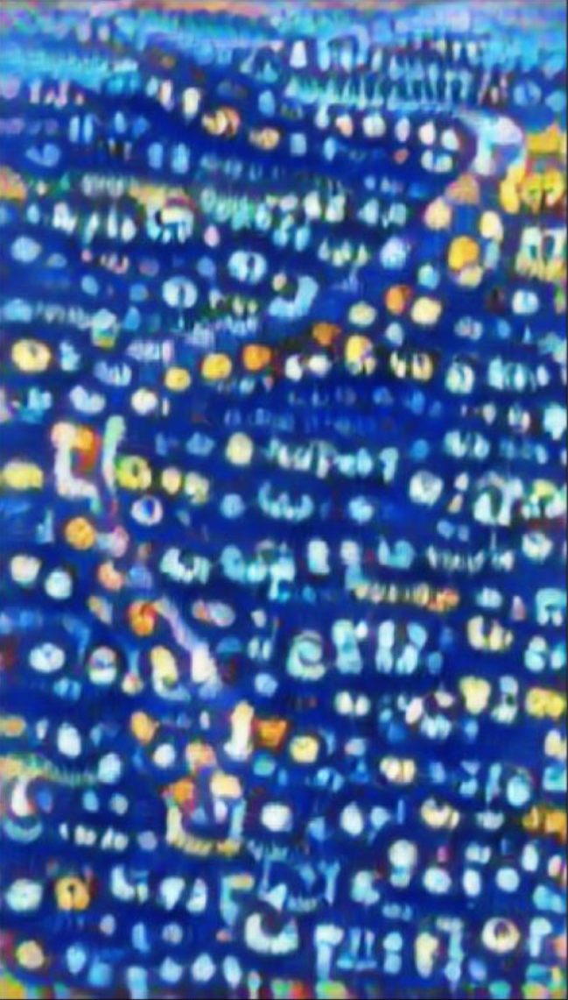

# Nerual Style Transfer

I used the following images 

I chose this one for content because I have really enjoyed getting to know people and have gained the skill of making real connection over a screen. Group projects have been a highlight and some of the people I have met I have had sincere and important conversations with outside of class and I really have appreciated that aspect. 

I used this one for the style because when I think about how the world is currently as well as how it was managing classes and work, it had the same overall feeling of chaos. I searched up the word chaos and this was the perfect image. It is fun in that it provides new experiences and opportunities, such as learning a large amount of data science in a short amount of time, but also captured the energy put into this program by everyone, teachers included. There was a lot of community in the chaos.

This was the final result.

I also really like snakes, and we used Python, so I tried to make a snake that had a code pattern and I used the following images for it.

Content image

Style image

This was the final result

I think it looks pretty cool as a subtle hint to Python in an artistic fashion but if you have any suggestions about how to make the outline of the snake better, or what to change in the code it is more than welcome.

The neural style transfer applied the patterns of shapes and color that appear in the style image on top of the content image, while the content image essentially acted as a base for the patterns to be applied to. The style image characteristics followed boundaries found in the content image, hence the outline of the snake in the latter example. 
