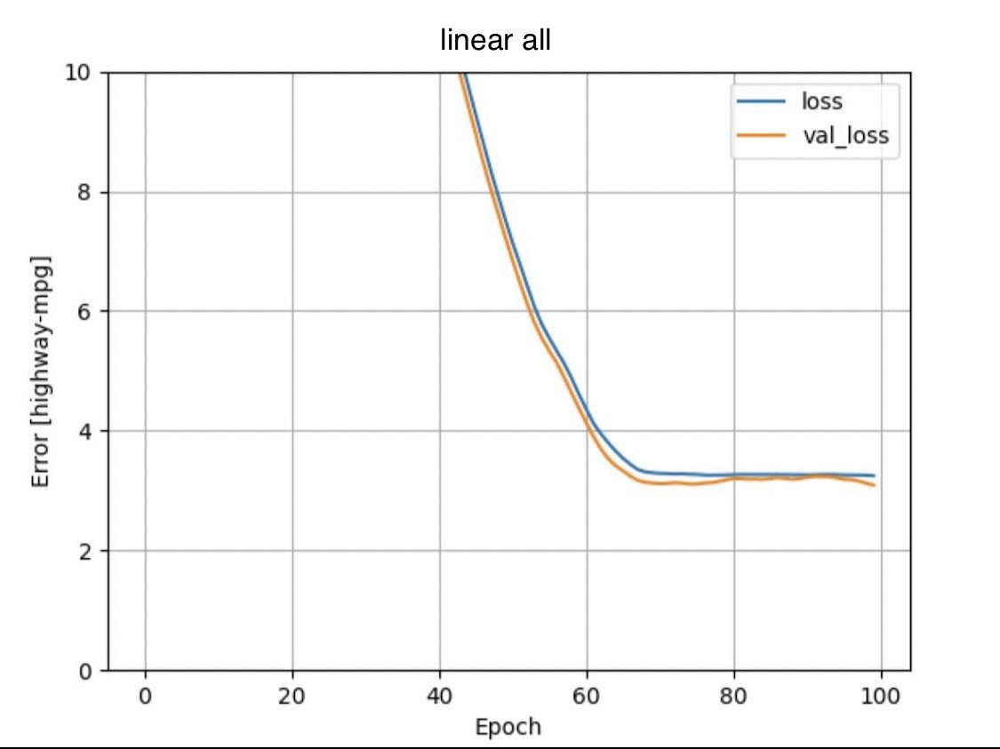
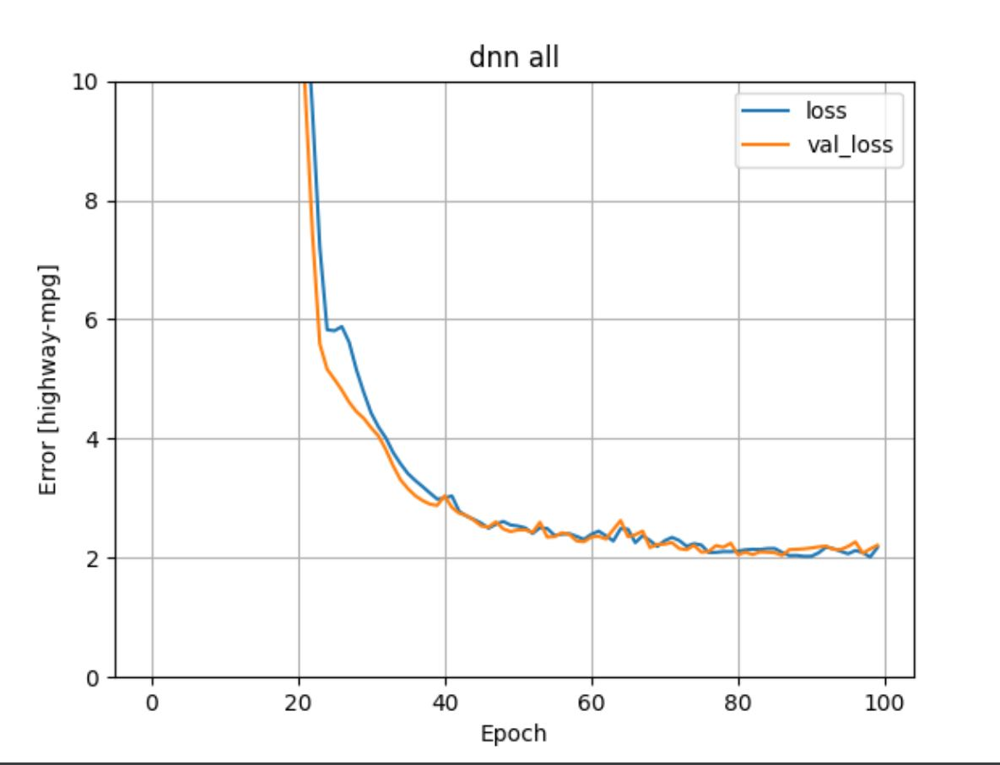
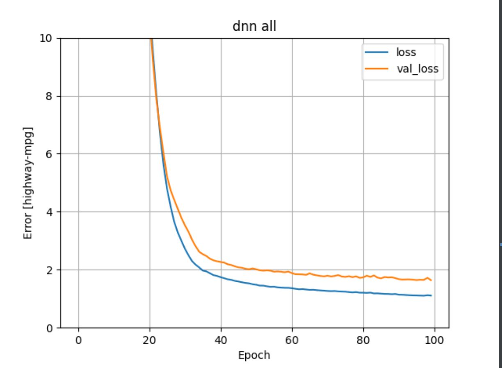

# Monday Response: Gwen and Alaa

## Multi-class Linear Model

## Multi-class DNN Model

To produce the above graphs, we used the following features: highway-mpg, num-of-cylinders, engine-size, curb-weight, horsepower. We used num-of-cylinders as our categorical data. The multi-class linear model produced a loss value of 2.51 and the multi-class dnn model produced a loss value of 2.08. The lower loss value of the dnn model indicates that the dnn model performed better. 

To improve the loss metric, we changed the features to the following: highway-mpg, make, engine-size, horsepower, curb-weight, price, length, peak-rpm, compression-ratio. We used make as our categorical data. The dnn regression model with the new features produced a loss value of 1.78. Therefore the best model was the dnn regression with the additional features that used make as the categorical data. The increase in features allowed for the model to learn from more data which in turn trained the model more efficiently to produce better results.

