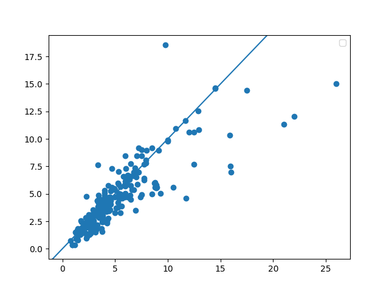

##Project 1

1. The model produced a correlation coefficient of 0.849, this indicates that the model predicted values that followed a relatively similar pattern to the actual prices and the model did a pretty good job. It followed the trend of the actual data about 85% of the time. The mean sqaured error was about 3.789 with the scaled data which is a decent mse value indicating the average squared difference between the predicted values and actual value was 3.789 which is relatively low for an mse value, another indication that the model fared well. The loss graph also indicated that the model learned fairly well as the number of iterations increased.
2. The scaling of the features would probably improve the model performance. I think finding a number specific to each feature that would ensure the most fair scaling for each feature would improve the model rather than using large baseline numbers to scale the data.
3. The model tended to overpredict home values. When comparing the differences between the actual price and the predicted price but subtracting the former from the latter, the 50th percentile of that data was at 0.26, just above a difference value of 0 indicating the model overpredicted. 
4. The predictions that were the most accurate were 
   
   idx, difference between predicted and listing values, listing value   
   34,    -0.027476,            $400000.0
   
   1,        -0.026910,         $339900.0
   
   71,        -0.022920         $239900.0   *most accurate
   
   358,    0.037507         $339645.0
   
   241,    0.044140         $535900.0
   
   13,      0.056361        $265000.0

   
   The most accurate prediction was of a house that cost 239,900$ which falls below the 25th percentile for all the house prices, and the second most accurate prediction also falls in that same category. The 25th percentile was $284900.0, the 50th percentile was $399220.0, and the 75th percentile was $617500.0. The 6 most accurate predictions ranged from below the 25th percentile to just above the 50th percentile. 
The most significant predictor appeared to be livingArea as removing that data from the data used to make the graph resulted in the largest change in mse. The fact that the removal of living area space from the data resulted in the largest change in mse when compared to the removal of the data regarding bedrooms or bathroom means that it affected the graph the most heavily.

