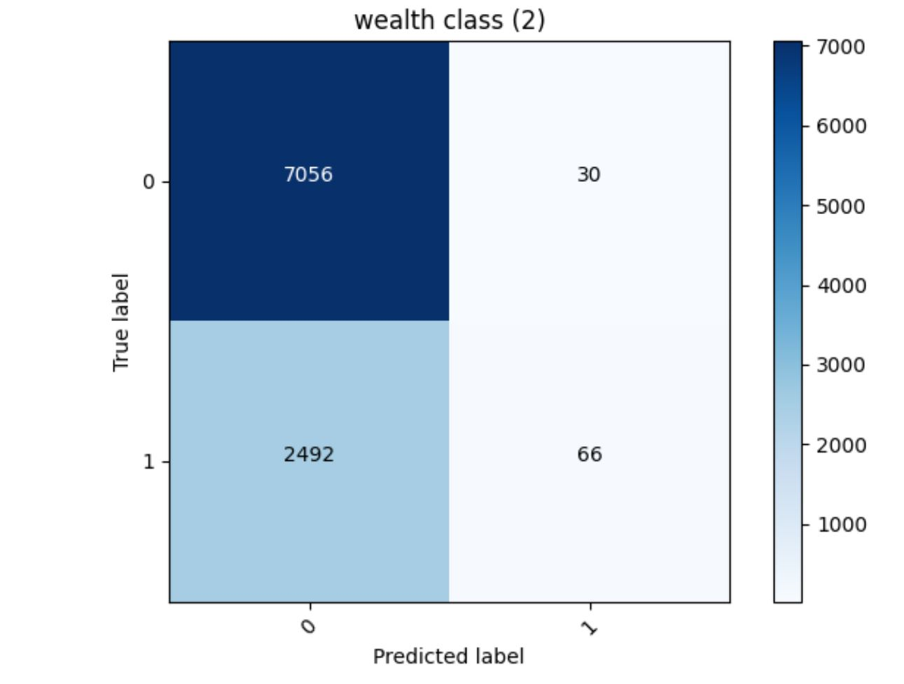
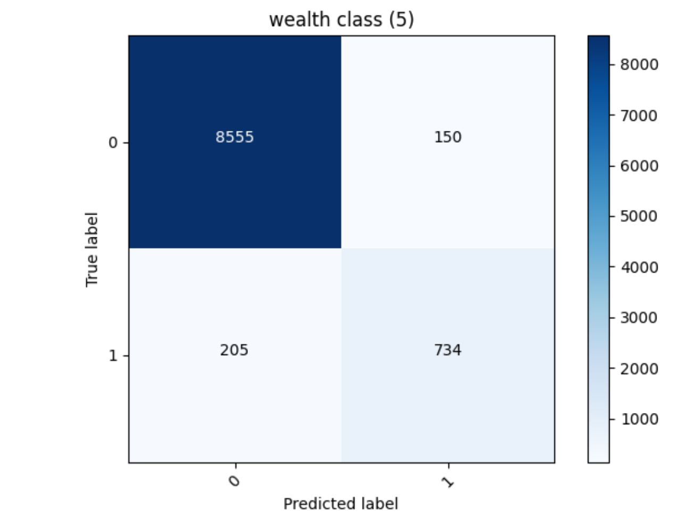
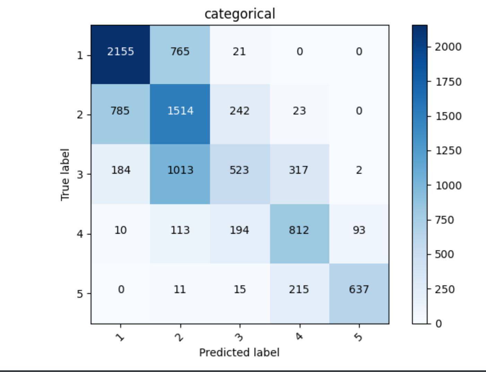
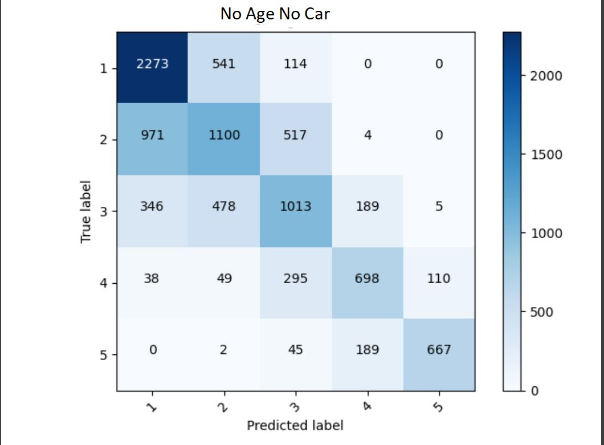

# Project 3

My model that made predictions of wealth class in a binary format, one wealth class against the rest, produced the following accuracies:
Wealth Class 1:  0.7951057553291321

Wealth Class 2 =  0.7384902238845825 *

Wealth Class 3 =  0.8045417070388794

Welath Class 4=  0.9112401604652405

Wealth Class 5=  0.9631895422935486 ***

 *least accurate predictions *** most accurate predictions

This model produced an accuracy of 0.7384902238845825. People in the middle wealth classes will have less consistency in features such as education, potable, toilet, and cook. The lowest wealth class likely had a higher accuracy because very low wealth areas tend to have little variance in their access to certain facilities, but middle wealth classes (2) may have greater inconsistency.  The model was likely to predict something was not wealth class 2 correctly.

This model produced an accuracy of 0.9631895422935486. The higher accuracy is likely due to the greater consistency of features like education, location, potable, toilet, and cook in higher wealth classes. It is more likely people of higher wealth classes have access to the same basic facilities. 

Next I designed a model that used the five wealth classes as categorical data.  

This model produced an accuracy of 0.584923267364502 and used the following indicator columns: gender, location, potable, toilet, car, cook, dropped the columns wealth, hhid, pnmbr, weights, and unit. For the numerical columns the model used size, age, and education. 

Then I attempted to improve the accuracy by removing certain features that were most likely to cause inconsistency that made it more difficult for the model to understand.

This model prodcued an accuracy of 0.5963293313980103 and used the following indicator columns: gender, location, potable, toilet, electric, cook, dropped the columns wealth, hhid, pnmbr, weights, and unit. It used size and education as the numerical columns.

I looked at the indicator features in the dataset and tried to determine which features were the most unpredictable. I chose to remove 'car' because wealthy people tend to live in big cities, and in big cities there is typically less need for a car. After a brief overlook of the dataset for any correlation between car and wealth I determined it was likely one of the more unpredictable features that could be causing the model to struggle. I then took a look at the numerical features and determined that 'age' would be the feature that had the least consistent correlation with wealth due to inheritance from wealthy parents, and in lower income areas the age also did not have a connection to wealth as everyone of every age would be more likely to have the same wealth. Removing those two features increased the accuracy by about 1.2%.

