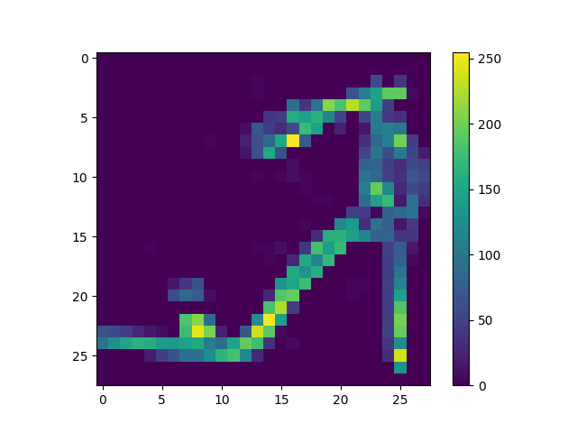
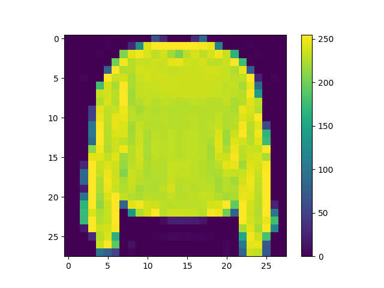
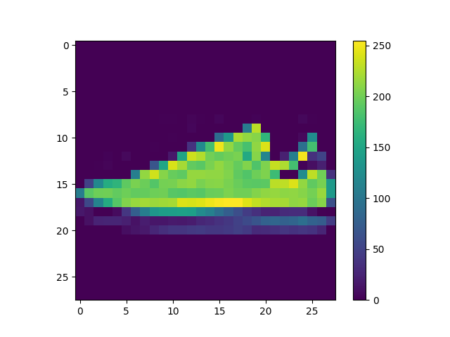
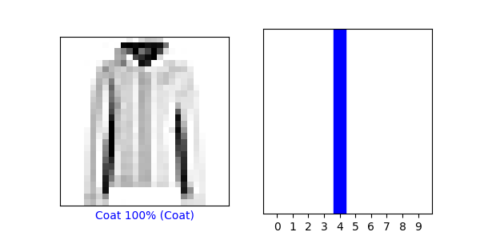
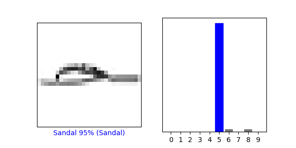
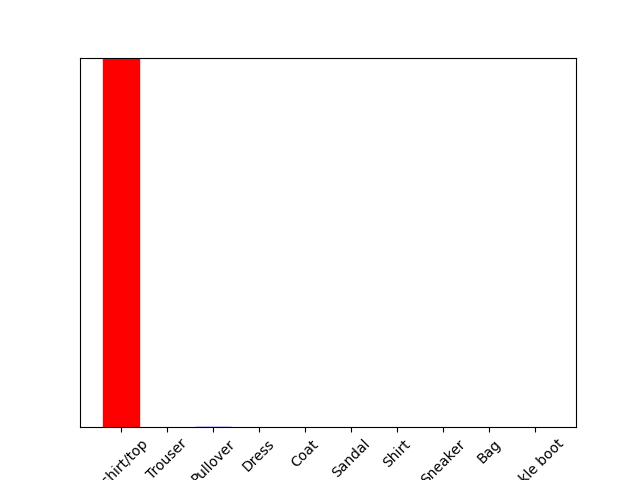
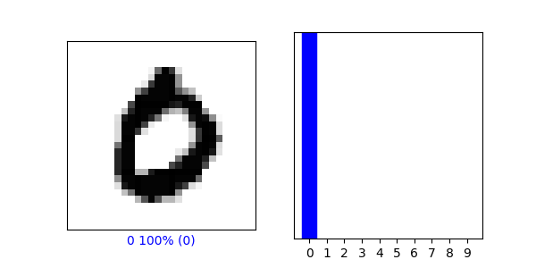
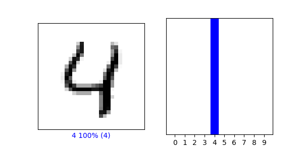

Wednesday's Response
1. 
   
   
2. - predictions[3]
     array
     ([3.6671641e-09, 1.0000000e+00, 8.4066903e-12, 2.8593914e-09,
     1.2264663e-09, 4.9193018e-22, 1.2822771e-09, 4.5023612e-27,
     1.0708230e-16, 2.3360760e-15], dtype=float32)
    - The numbers in the array represent the confidence in its prediction that the image corresponds to the correct label.
    - Softmax turned the output of the code "probability_model = tf.keras.Sequential([model, tf.keras.layers.Softmax()])" into probability distributions so they can be interpreted by the same scale.
    - Argmax was used to return the number of the predictions array of the image from the array with the highest probability of being correct, from the code 'np.argmax(predictions[2500])'.
    - Yes the argmax from the predictions array matched the label from the test_labels dataset using np.argmax(predictions[1050]) and test_labels[1050], they both returned 4.
3.  - 
      
    - 
    

4. 
    - 
    -  No the predicted value did not match the test label.
    - We did not sue Softmax when determining if the test label matched the predicted value of the trained model because in the line 'predictions_single = probability_model.predict(img)' we use 'probability_model' which we already defined to have the Softmax function in it back in the 'Make Predictions' section.
    
5. - The accuracy of the training dataset was 0.9980
    - The accuracy of the testing dataset was 0.9774
   
      
    
      - The training data set was more accurate, I think this is because our dataset was small and we only had ten classifications and the numbers look very different from on another making it easier to train a model.
